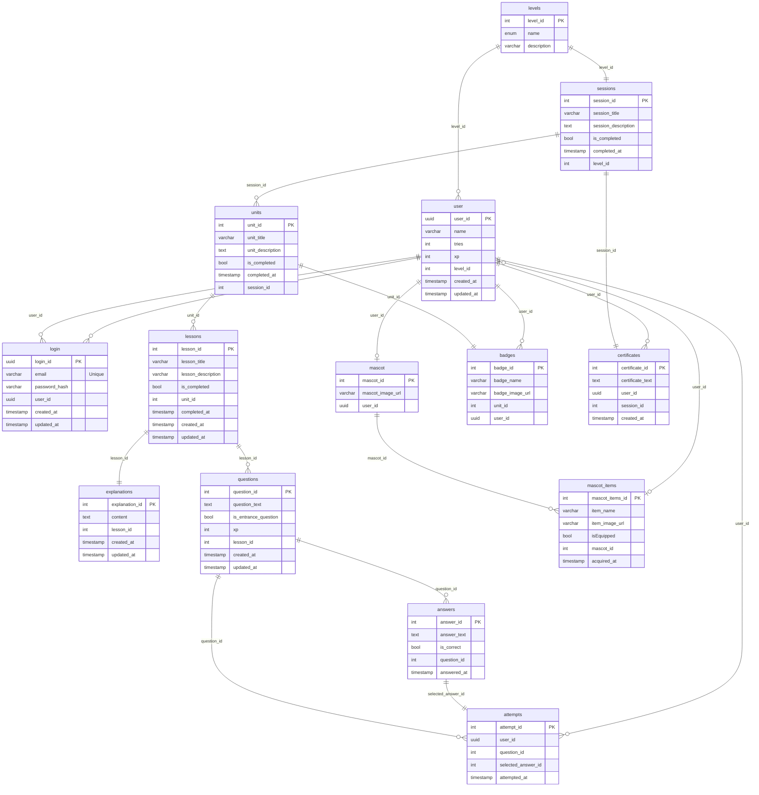

```mermaid
erDiagram
    user {
      uuid user_id PK
      varchar name
      int tries
      int xp
      int level_id
      timestamp created_at
      timestamp updated_at
    }

    login {
      uuid login_id PK
      varchar email "Unique"
      varchar password_hash
      uuid user_id
      timestamp created_at
      timestamp updated_at
    }

    levels {
      int level_id PK
      enum name
      varchar description
    }

    sessions {
      int session_id PK
      varchar session_title
      text session_description
      bool is_completed
      timestamp completed_at
      int level_id
    }

    units {
      int unit_id PK
      varchar unit_title
      text unit_description
      bool is_completed
      timestamp completed_at
      int session_id
    }

    lessons {
      int lesson_id PK
      varchar lesson_title
      varchar lesson_description
      bool is_completed
      int unit_id
      timestamp completed_at
      timestamp created_at
      timestamp updated_at
    }

    explanations {
      int explanation_id PK
      text content
      int lesson_id
      timestamp created_at
      timestamp updated_at
    }

    questions {
      int question_id PK
      text question_text
      bool is_entrance_question
      int xp
      int lesson_id
      timestamp created_at
      timestamp updated_at
    }

    answers {
      int answer_id PK
      text answer_text
      bool is_correct
      int question_id
      timestamp answered_at
    }

    attempts {
      int attempt_id PK
      uuid user_id
      int question_id
      int selected_answer_id
      timestamp attempted_at
    }

    mascot {
      int mascot_id PK
      varchar mascot_image_url
      uuid user_id
    }

    mascot_items {
      int mascot_items_id PK
      varchar item_name
      varchar item_image_url
      bool isEquipped
      int mascot_id
      timestamp acquired_at
    }

    badges {
      int badge_id PK
      varchar badge_name
      varchar badge_image_url
      int unit_id
      uuid user_id
    }

    certificates {
      int certificate_id PK
      text certificate_text
      uuid user_id
      int session_id
      timestamp created_at
    }

    user ||--o{ login : "user_id"
    user ||--o{ attempts : "user_id"
    user ||--o{ certificates : "user_id"
    user ||--o| mascot : "user_id"
    user ||--o{ badges : "user_id"
    user }o--o| mascot_items : "user_id"
    login }o--|| user : "user_id"
    levels ||--o{ user : "level_id"
    levels ||--|| sessions : "level_id"
    sessions ||--o{ units : "session_id"
    units ||--o{ lessons : "unit_id"
    lessons ||--|| explanations : "lesson_id"
    lessons ||--o{ questions : "lesson_id"
    questions ||--o{ answers : "question_id"
    answers ||--|| attempts : "selected_answer_id"
    questions ||--o{ attempts : "question_id"
    units ||--|| badges : "unit_id"
    sessions ||--|| certificates : "session_id"
    mascot ||--o{ mascot_items : "mascot_id"
```