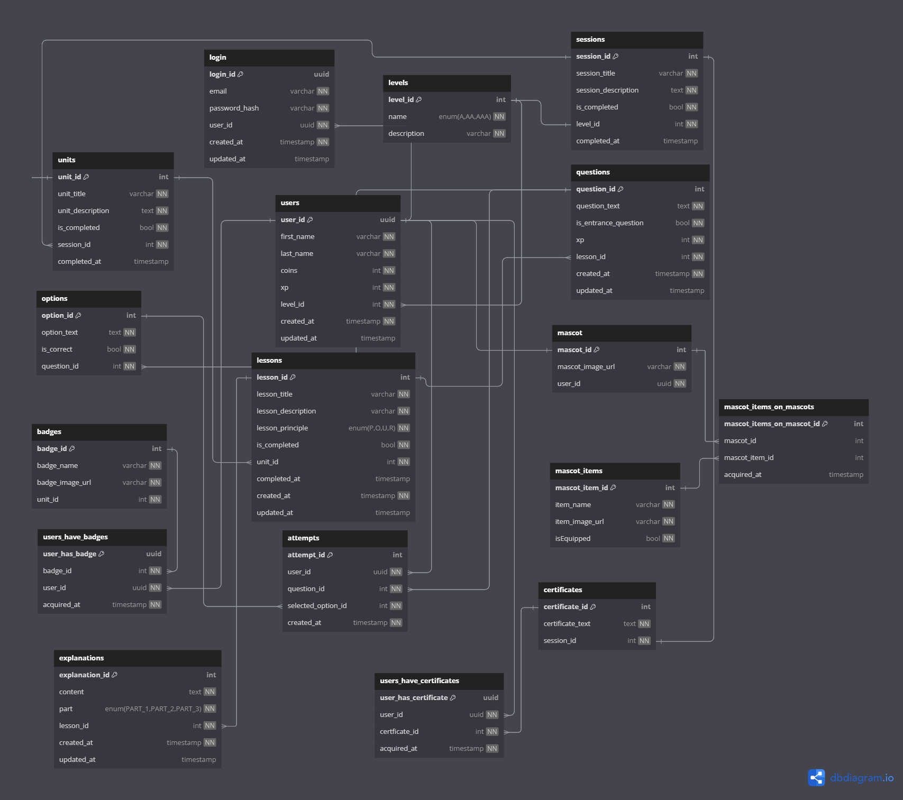

# Modoke
Esta API foi desenvolvida para o Modoke, uma aplicação desenvolvida para a cadeira de Projeto Integrado I, da Universidade Federal do Ceará (UFC). O Modoke é uma plataforma de e-learning que tem como principal objetivo ensinar a desenvolvedores web (iniciantes e intermediários) sobre acessibilidade web. 

## Sobre a API
A estrutura desta API segue o padrão RESTful, desenvolvida utilizando o framework Fastify e TypeScript. O código foi estruturado de uma forma similar ao padrão MVC (Model-View-Controller), com a separação de rotas, controladores e modelos. Além disso, foi utilizado o Prisma como ORM para o gerenciamento e a comunicação com o banco de dados PostgreSQL. O Docker foi utilizado para a criação de um container para a própria aplicação e para o banco de dados PostgreSQL (Docker Compose). O Swagger foi utilizado para a documentação da API. Utilizou-se ainda o Amazon S3 para o armazenamento de arquivos em nuvem.

## Tecnologias Utilizadas
- Node.js
- Fastify
- TypeScript
- Prisma
- Docker
- PostgreSQL

## Diagrama Entidade-Relacionamento


## Instalação
1. Clone este repositório
```bash
git clone https://github.com/JoaoBarroso4/api-projeto.git
```
2. Instale as dependências
```bash
npm install
```
3. Crie um arquivo `.env` na raiz do projeto e adicione as seguintes variáveis de ambiente:
```bash
DATABASE_URL="postgresql://<user>:<password>@<host>:<port>/<database>"
JWT_SECRET="<secret>"
JWT_EXPIRATION="<time>"
PORT=<port>

NODEMAILER_USER="<user>"
NODEMAILER_PASSWORD="<password>"
EMAIL_PORT=<email_port>
EMAIL_HOST="<host>"

AWS_ACCESS_KEY_ID="<access_key_id>"
AWS_SECRET_ACCESS_KEY="<secret_access_key>"
AWS_REGION="<region>"
AWS_BUCKET_NAME="<bucket_name>"
```
4. Crie o container do banco de dados
```bash
docker-compose up -d
```
5. Execute as migrações do banco de dados
```bash
npx prisma migrate dev
```
6. Inicie a aplicação
```bash
npm run start
```
A aplicação estará disponível em `http://localhost:<port>`. Documentação em `http://localhost:<port>/docs`.

## Rotas
### Usuários
- Protegidas
  - `GET /user/`: Busca um usuário por id  
  - `GET /user{email}`: Busca um usuário pelo email
  - `PUT /user/`: Atualiza um usuário por id
  - `PUT /user/level`: Atualiza o nível de um usuário
  - `PUT /user/password`: Atualiza a senha de um usuário
- Não protegidas
  - `POST /user/`: Cria um novo usuário
  - `POST /user/login`: Autentica um usuário


### Níveis
- Não protegidas
  - `GET /level/`: Busca todos os níveis
  - `GET /level/id{level_id}`: Busca um nível por id

### Lições
- Protegidas
  - `GET /lesson/user`: Busca a lição em progresso de um usuário
  - `GET /lesson/finished`: Busca as lições finalizadas de um usuário
  - `POST /lesson/`: Cria uma nova lição (ADMIN)
  - `PUT /lesson/unlock{lesson_id}`: Desbloqueia uma lição
  - `PUT /lesson/finish{lesson_id}`: Finaliza uma lição
- Não protegidas
  - `GET /lesson/id{lesson_id}`: Busca uma lição por id
  - `GET /lesson/level{level_id}`: Busca todas as lições de um nível
  - `GET /lesson/unit{unit_id}`: Busca todas as lições de uma unidade
  - `GET /lesson/section{section_id}`: Busca todas as lições de uma seção

### Unidades
- Protegidas
  - `GET /unit/user`: Busca a unidade em progresso de um usuário
  - `POST /unit/`: Cria uma nova unidade (ADMIN)
  - `PUT /unit/unlock{unit_id}`: Desbloqueia uma unidade
  - `PUT /unit/finish{unit_id}`: Finaliza uma unidade
- Não protegidas
  - `GET /unit/`: Busca todas as unidades
  - `GET /unit/id{unit_id}`: Busca uma unidade por id
  - `GET /unit/section{section_id}`: Busca todas as unidades de uma seção

### Explicações
- Protegidas
  - `GET /explanation{lesson_id}`: Busca todas as explicações de uma lição
  - `POST /explanation/`: Cria uma nova explicação (ADMIN)

### Seções
- Protegidas
  - `GET /section/user`: Busca a seção em progresso de um usuário
  - `POST /section/`: Cria uma nova seção (ADMIN)
  - `PUT /section/unlock{section_id}`: Desbloqueia uma seção
  - `PUT /section/finish{section_id}`: Finaliza uma seção
- Não protegidas
  - `GET /section/`: Busca todas as seções

### Questões
- Protegidas
  - `GET /question/lesson{lesson_id}`: Busca todas as questões (enunciados e alternativas) de uma lição
  - `GET /question/unit{unit_id}`: Busca todas as questões (enunciados e alternativas) de uma unidade
  - `GET /question/entranceTest`: Busca todas as questões (enunciados e alternativas) do teste de familiaridade
  - `POST /question/`: Cria uma nova questão (ADMIN)

### Alternativas
- Protegidas
  - `POST /option/`: Cria uma nova alternativa (ADMIN)

### Tentativas
- Protegidas
  - `GET /attempt/last{question_id}`: Busca a última tentativa de uma questão
  - `POST /attempt/`: Cria uma nova tentativa (ADMIN)

### Emblemas
- `GET /badge/`: Busca todos os emblemas
- `GET /badge/user`: Busca todos os emblemas de um usuário
- `GET /badge/unit{unit_id}`: Busca todos os emblemas de uma unidade
- `POST /badge/`: Cria um novo emblema (ADMIN)
- `POST /badge/assign`: Atribui um emblema a um usuário

### Certificados
- Protegidas
  - `GET /certificate/user`: Busca todos os certificados de um usuário
  - `POST /certificate/`: Cria um novo certificado (ADMIN)
  - `POST /certificate/assign`: Atribui um certificado a um usuário

## Mapeamento de requisitos funcionais

### RF02 - Imagens
- `/images/upload`

### RF03 - Cadastro
- `/user/register`
- `/auth/google/register`

### RF04 - Autenticação do usuário
- `/user/login`
- `/auth/google/login`

### RF05 - Salvamento de progresso
- `/section/unlock`
- `/unit/unlock`
- `/lesson/unlock`
- `/section/finish`
- `/unit/finish`
- `/lesson/finish`

### RF06 - Acesso a lições
- `/lessons/*`
- `/explanations/*`

### RF07 - Resolução de questões
- `/questions/*`
- `/options/*`
- `/attempts/*`

### RF08 - Sistema de níveis e experiência
- `/levels/`
- `/user/level`

### RF09 - Emblemas
- `/badges/*`

### RF11 - Perfil
- `/user`


## Produção
A documentação da aplicação está disponível em produção no Railway: https://modoke-api-production.up.railway.app/docs.
