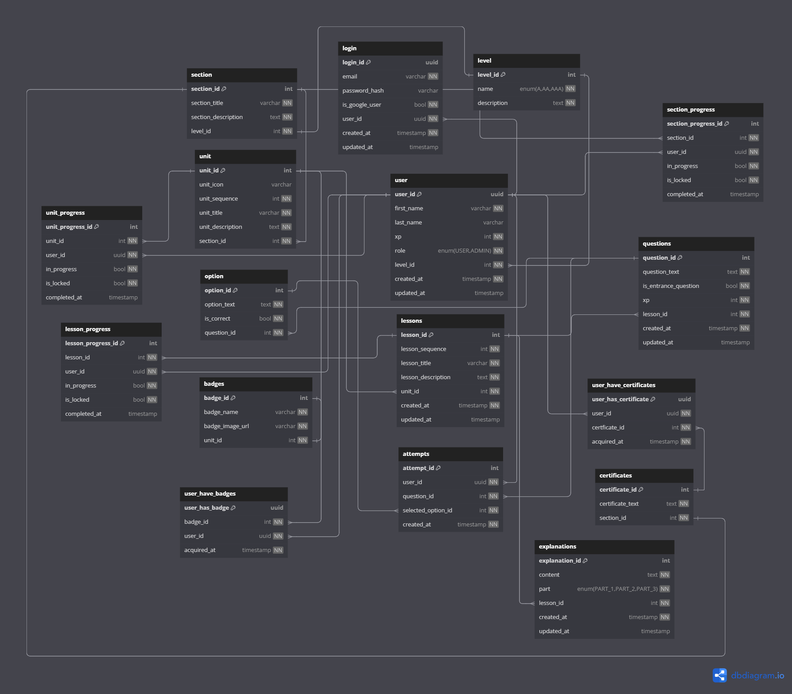

## Ordem de desenvolvimento
1. Criar o projeto
2. Configurar o projeto (tsconfig.json, package.json, tsx, server.ts)
3. Criar a estrutura de pastas
4. Criar e configurar o docker-compose.yml
4. Configurar prisma (prisma.ts) e criar o esquema de banco de dados
5. Efetuar migration
6. Criar e configurar jwt
7. Criar validators 
8. Criar middleware 
9. Criar errors 
10. Criar models 
11. Criar services 
12. Criar controllers
13. Criar rotas
14. Adicionar rotas ao server.ts
15. Criar e configurar swagger

## Diagrama Entidade-Relacionamento
